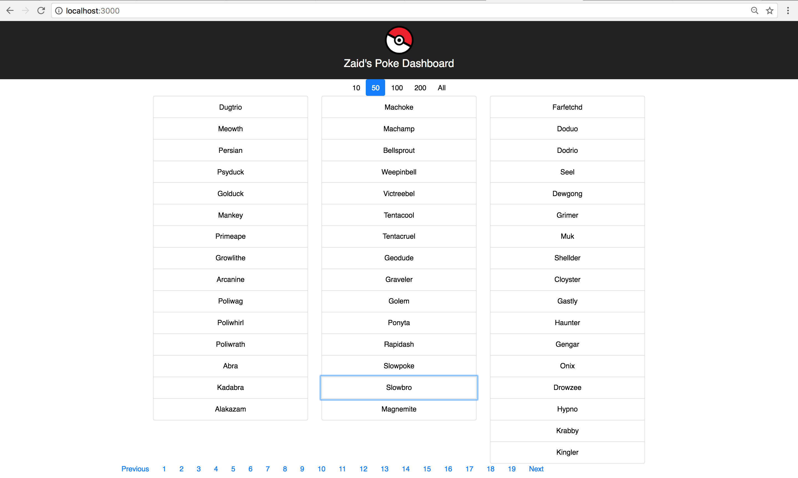
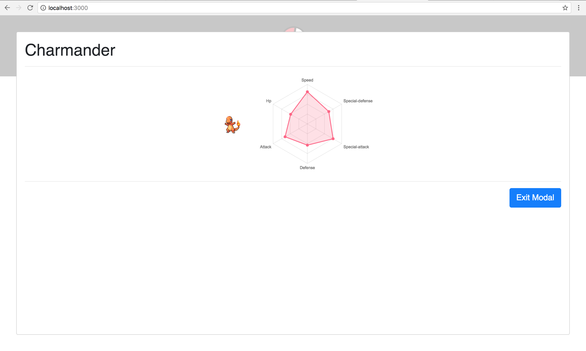

<!-- prettier-ignore -->
PokeDashboard is web app that:
    created using npm-create-react-app
    created with multiple reacted components
    pulls data from the open-source api poke-api
    uses react modals to display the attributes of the clicked on pokemon
    uses react-bootstrap to organize the on-screen organization of its components
    uses stateless components and ones with state as well
    uses react-chartjs library to display pokemon ability
    uses prttier and other plug-ins to appropriately format code

Home Page View:

Pokemon Modal View:

